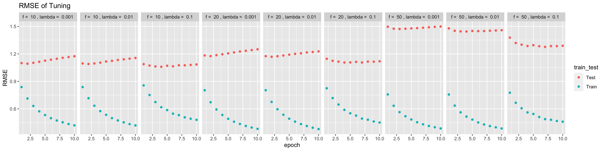

In this project, we applied the following methods for collaborative filtering:

- factorization algorithm: Stochastic Gradient Descent

- regularization: Temporal Dynamics

- postpocessing: KNN & Kernel Ridge Regression

Our objective is to compare the postporcessing process, and evaluate their results.

### Step 1 Load Data and Train-test Split

```{r Data Preparison warning=FALSE, message=FALSE}
library(dplyr)
library(tidyr)
library(ggplot2)
library(anytime)
library(ggplot2)
library(lubridate)
data <- read.csv("../data/ml-latest-small/ratings.csv")
set.seed(0)

# Function for dividing time into bins, and add bins to the original data 
data_m <- data %>% 
  mutate(date=anytime(timestamp) %>% format("%Y/%m/%d"),
         year = year(date))

n_date <- data_m %>% summarise(n_distinct(date)) %>% as.numeric() #4105
n_year <- data_m %>% summarise(n_distinct(year)) %>% as.numeric() #23 years, 137 month
min_date <- data_m %>% summarise(as.Date(min(date))) %>% as.numeric() #"1996-03-29"

bins <- function(n, data = data){
  data$date <- anytime(data$timestamp) %>% format("%Y/%m/%d") 
  df <- data %>% mutate(year = year(date), bin_label = year-1995) %>% data.frame() %>% select(userId, movieId, rating, timestamp, bin_label, date, year)
  min_day <- df %>% summarise(as.Date(min(date))) %>% as.numeric()
  df <- df %>% mutate(days_diff=as.numeric(as.Date(date)-min_day)+1) %>% group_by(userId) %>% mutate(user_mean_date=mean(days_diff))
  return(df)
}

data_bins <- bins(30, data=data) 

test_idx <- sample(1:nrow(data_bins), round(nrow(data_bins)/5, 0))
train_idx <- setdiff(1:nrow(data), test_idx)
data_train <- data_bins[train_idx,]
data_test <- data_bins[test_idx,]

```


### Step 2 Matrix Factorization

#### Step 2.1 Algorithm and Regularization

- Algorithm: Stochastic Gradient Descent (A1)

- Regularizations: Temporal Dynamics (R3)

```{r}
U <- length(unique(data_m$userId)) #610
I <- length(unique(data_m$movieId)) #9724
source("../lib/Matrix_Factorization.R")
```


#### Step 2.2 Parameter Tuning

We used cross validation to tune the 2 hyperparameters: f and lambda, and select the optimal combination by choosing the one with lowest test RMSE

```{r}
source("../lib/cross_validation.R")
f_list <- c(10, 20, 50)
l_list <- seq(-3,-1,1)
f_l <- expand.grid(f_list, l_list)
```

```{r, eval=FALSE}
result_summary <- array(NA, dim = c(4, 10, nrow(f_l))) 
run_time <- system.time(for(i in 1:nrow(f_l)){
    par <- paste("f = ", f_l[i,1], ", lambda = ", 10^f_l[i,2])
    cat(par, "\n")
    current_result <- cv.function(data_m, K = 3, f = f_l[i,1], lambda = 10^f_l[i,2])
    result_summary[,,i] <- matrix(unlist(current_result), ncol = 10, byrow = T) 
    print(result_summary)
  
})

save(result_summary, file = "../output/rmse.Rdata")
```

```{r}
load("../output/rmse.Rdata")

rmse <- data.frame(rbind(t(result_summary[1,,]), t(result_summary[2,,])), 
                   train_test = rep(c("Train", "Test"), each = 9), 
                   par = rep(paste("f = ", f_l[,1], ", lambda = ", 10^f_l[,2]), times = 2)) %>%
  gather("epoch", "RMSE", -train_test, -par)

rmse$epoch <- as.numeric(gsub("X", "", rmse$epoch))

cv.result <- ggplot(rmse, aes(x = epoch, y = RMSE, col = train_test)) + geom_point() + 
  facet_grid(~par)+ggtitle("RMSE of Tuning")
ggsave(plot=cv.result, filename = "cv_result.jpg",height = 100, width = 400, units="mm")
```

[CV]

Here is the train and test RMSE for selected set of hyper parameters

```{r message=F}
load(file = "../output/mat_fac.RData")

RMSE <- data.frame(epochs = seq(10, 100, 10), 
                   Training_MSE = result$train_RMSE, 
                   Test_MSE = result$test_RMSE) %>% 
  gather(key = train_or_test, value = RMSE, -epochs)

ggplot(RMSE, aes(x = epochs, y = RMSE,col = train_or_test)) + 
  geom_point() + scale_x_discrete(limits = seq(10, 100, 10)) + 
  xlim(c(0, 100)) + 
  ggtitle("RMSE (f=10, lambda=0.1)")
```

```{r, eval= FALSE}
result <- gradesc(f = 10, lambda = 0.1,lrate = 0.01, max.iter = 20, stopping.deriv = 0.01,
                   data = data_m, train = data_train, test = data_test)

```


